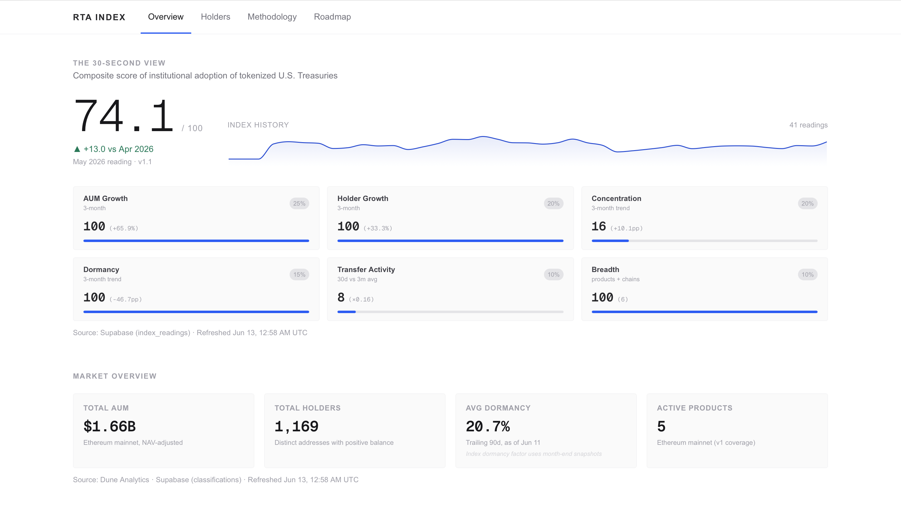

# RTA Index — Tokenized Treasury Adoption Index

**Live:** [tt-adoption-index.vercel.app](https://tt-adoption-index.vercel.app)

A public dashboard around a single number: a 0–100 composite index measuring institutional adoption of tokenized U.S. Treasuries on Ethereum mainnet.

**Current reading: 74.1 (May 2026), +13.0 vs April.** Above 50 means adoption is accelerating; below 50, contracting. 41 monthly readings backfilled to January 2023.



## What it measures

Five funds — BlackRock BUIDL, Ondo OUSG & USDY, Superstate USTB, Hashnote USYC — covering ~$1.66B in Ethereum-mainnet AUM across ~1,170 holders. The index is a weighted composite of six factors:

| Factor | Weight |
|---|---|
| AUM growth (3-month) | 25% |
| Holder growth (3-month) | 20% |
| Concentration trend (3-month, inverted) | 20% |
| Dormancy trend (3-month, inverted, supply-weighted) | 15% |
| Transfer activity (30d vs 3m) | 10% |
| Breadth (products × chains) | 10% |

Each factor maps to 0–100 via a fixed piecewise-linear range calibrated on the historical backfill; range changes require a methodology version bump. Full definitions, normalization ranges, and a changelog are on the [methodology page](https://tt-adoption-index.vercel.app/methodology).

## The behavioral layer

Beyond the index, the dashboard classifies every holder wallet over a trailing 90-day window — Accumulating, Active, Distributing, or Dormant — by replaying on-chain transfer history.

**Key finding: eligibility determines behavior.** BUIDL (qualified purchasers, $5M minimum) shows ~73% dormancy — capital parked by institutional desks. USTB shows ~6%. USDY ($5K minimum, non-US) behaves payments-like. Who is *allowed* to hold a token predicts what holders *do* with it.

## Architecture

```
Etherscan + Dune (query 7696914)
        │
        ▼
classify pipeline (local, npm run classify)
        │
        ▼
Supabase (Postgres) ── snapshots, index readings, holder classifications
        │
        ▼
Next.js 16 site on Vercel (reads Supabase; market data live, 1h cache)
```

- **Next.js 16** + TypeScript + Tailwind + recharts, deployed on Vercel
- **Supabase** stores classifications and monthly index snapshots; the site reads stored results, never raw chain data at request time
- Builds make zero API calls (Partial Prerender); data pages render on demand
- NAVs are hardcoded with as-of dates and refreshed monthly (live oracles are on the roadmap)

## Verification discipline

This project was built with AI assistance (Claude for verification, Claude Code for implementation) — which made independent verification the core engineering discipline, not an afterthought. Eleven significant bugs were caught and documented along the way, including a hallucinated contract address, a NAV assumption that overstated one fund's AUM 116×, and silently cached empty API responses.

The working rules that emerged:

1. **Verify every number against an independent source** (Etherscan vs Dune vs rwa.xyz).
2. **Local success ≠ production success** — a warm cache can mask incomplete fetches.
3. **Contract addresses live in one config file** for manual verification.

The full bug history is kept in [STATUS.md](STATUS.md).

## Coverage notes

- Ethereum mainnet only in v1. Ethereum's share of each fund's total AUM ranges from ~3% (USYC) to ~51% (USDY), so the index measures Ethereum-chain adoption specifically.
- BUIDL-I (~$829M, 6 holders) is excluded: single-digit holder counts measure desk allocation, not adoption. Franklin Templeton BENJI is excluded pending multi-chain support (v2.0).
- Each address counts as one holder; omnibus custodial wallets may overstate concentration and dormancy. Labeled custodians are flagged where available.

## Roadmap

1. **Automated daily classification** via GitHub Actions (next)
2. **Multi-chain + BENJI** → methodology v2.0, with a formal restricted-share-class policy
3. **More funds, live NAV feeds, wrapper-aware classification** (e.g., Flux fOUSG flows)
4. **Perps comparison dashboard** — T-bill yields vs on-chain funding rates

Details in [ROADMAP.md](ROADMAP.md).

## Running locally

```bash
git clone https://github.com/hunteramen07/tt-adoption-index
cd tt-adoption-index
npm install
cp .env.local.example .env.local   # Etherscan, Dune, Supabase keys
npm run dev
```

`npm run classify` runs the holder-classification pipeline and writes results to Supabase.

## Methodology versioning

- **v1.0** (June 10, 2026) — initial release
- **v1.1** (June 11, 2026) — dormancy aggregation corrected to supply-weighted; all historical readings restated

---

Built by Hunter Amen (Boston College CSOM '29). Data: Dune Analytics, Etherscan, Supabase, issuer disclosures. Not investment advice.
